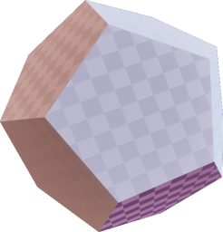
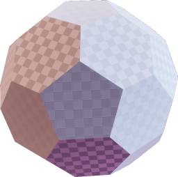
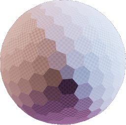
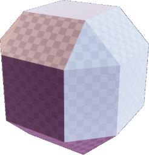
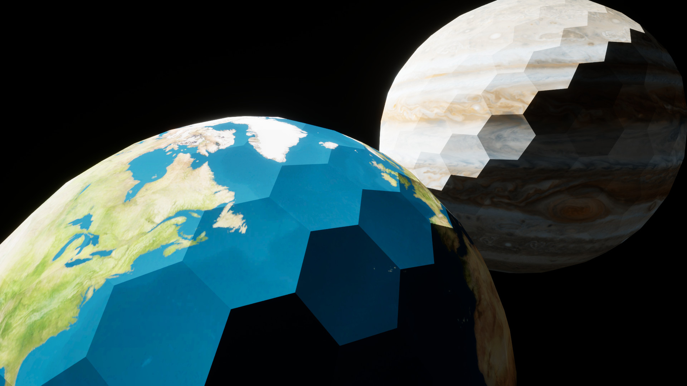

# UEPolyhedron
Polyhedron Procedural Meshes in Unreal Engine

Using this UE5 plug-in, you can quickly add procedurally-built Polyhedron meshes in your UE project. The meshes include UV Mapping and Tangents for normal-maps.

# User Interface
The main user interface for the plug-in is the APolyhedronConway Actor.
It has the following properties:
* `ConwayPolyhedronNotation` determines the shape of the polyhedron. See below for more details.
* `Scale` will size the polyhedron to fit a sphere with a radius of Scale.
* `EnableCollision` enables the collision and physics geometry on the primitive component. Please use this feature carefully, since UE has trouble with large complex physics geometry.
* `Material` is the one-and-only material applied to the entire Polyhedron. The PolyhedronComponent supports multiple materials; you will need to write C++ code to leverage this feature.
* `UVGeneration` controls the generation of texture coordinates. See below for more details.

### Conway Notation
In the PolyhedronConway actor, you will need to write a notation string that includes a starter polyhedron and a sequence of [Conway Polyhedron Notation](https://en.wikipedia.org/wiki/Conway_polyhedron_notation) operations.
This string is parsed from back to front.

The following starter polyhedra are supported:
* `A<n>` [Antiprism](https://en.wikipedia.org/wiki/Antiprism) where `<n>` is the number of vertices at each base. `<n>` must be >= 2. A special case: `A2` makes a Tetrahedron.
* `C` [Cube](https://en.wikipedia.org/wiki/Cube)
* `D` [Dodecahedron](https://en.wikipedia.org/wiki/Dodecahedron)
* `I` [Icosahedron](https://en.wikipedia.org/wiki/Icosahedron)
* `O` [Octahedron](https://en.wikipedia.org/wiki/Octahedron)
* `P<n>` [Prism](https://en.wikipedia.org/wiki/Prism_(geometry)) where `<n>` is the number of quads at the sides and the number of vertices at each base. `<n>` must be >= 3. For example: `P3` makes a [Triangular Prism](https://en.wikipedia.org/wiki/Triangular_prism) and `P5` makes a [Pentagonal Prism](https://en.wikipedia.org/wiki/Pentagonal_prism).
* `T` [Tetrahedron](https://en.wikipedia.org/wiki/Tetrahedron)
* `Y<n>` [Pyramid](https://en.wikipedia.org/wiki/Pyramid_(geometry)) where `<n>` is the number of vertices at the base. `<n>` must be >= 3.

The following operations are supported:
* `a` Ambo
* `b` Bevel
* `c` Chamfer
* `d` Dual
* `e` Expand
* `g` Gyro
* `j` Join
* `k` Kis or Triakis
* `m` Meta
* `o` Ortho
* `s` Snub
* `t` Truncate

I can add more starter polyhedra and operations on request.

#### Examples

 | **Notation** |  `D` or `dI` | `tI` | `tktI` | `eC` |
 |----|----|----|----|----|
 | |  |  |  |  | 
 | | [Regular Dodecahedron](https://en.wikipedia.org/wiki/Dodecahedron) |  Soccer ball / [Truncated Icosahedron](https://en.wikipedia.org/wiki/Truncated_icosahedron) | Golf ball | Expanded Cube | 

#### Goldberg Polyhedron
For more details on Goldberg Polyhedron and its notation: https://en.wikipedia.org/wiki/Goldberg_polyhedron.
* `dI` is GP(1,0).
* `tI` is GP(1,1).
* `tktI` is GP(3,3).
* `tktktI` is GP(6,6).

### Texture Coordinate Generation
Three Texture Coordinate Generation functions are offered. Unreal will automatically generated the tangent-space so that you can apply normal maps on the Polyhedron. You can also disable texture coordinate generation.
* `None` disables texture coordinate generation. You should disable texture coordinates if your material has tri-planar mapping or uses cube-maps.
* `Cellular` generates texture coordinates to keep the center of each polygon at the center of the texture and to grow each polygon as large as possible within the texture. This UV generation should be used to project one texture map unto each polygon of the polyhedron. This works well when each polygon is intended to have gameplay value.
* `Spherical` generates texture coordinates by applying a spherical projection. This generates texels of non-uniform sizes. This UV generation should be used to project one texture map unto the polyhedron. This has a known problem at the poles. This works well to build planets or asteroids.
* `Cubic` generates texture coordinates by applying a cubic projection. This generates texels of non-uniform sizes and will show seams. This works well for props.

# References and Inspiration
Based on the [Polyhédronisme](https://levskaya.github.io/polyhedronisme/) project.
Copyright 2019, Anselm Levskaya.
The PolyhedronConway actor notation is intended to match Polyhédronisme's notation. See the [Polyhédronisme User Interface](https://github.com/levskaya/polyhedronisme) for more details.

Based on earlier work from [George W. Hart](http://www.georgehart.com/).

# Screenshots
Earth and Jupiter Textures applied to `tktI`

